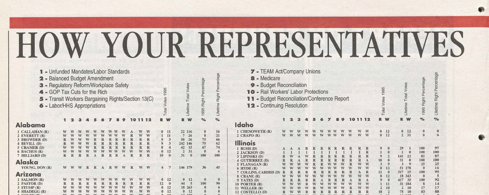
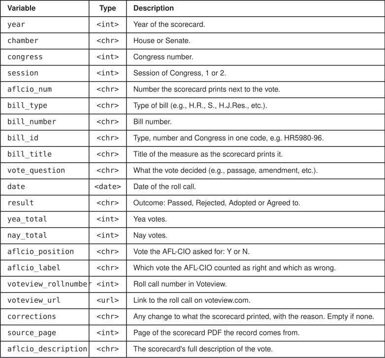
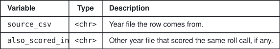

<h1 align="center">AFL-CIO Legislative Scoreboards</h1>

  
  
  
  

  

<table align="center" width="100%" frame="box">
  <tr>
    <td align="center">
      This repository collects AFL-CIO <b>legislative scoreboards</b> of the U.S. Congress between 1967 and 2025 and provides <b>machine-readable, bill-level CSV files</b>.
    </td>
  </tr>
</table>

###  Data

  <picture><source media="(prefers-color-scheme: dark)" srcset="img/data_c1_dark.svg#h"></picture><picture><source media="(prefers-color-scheme: dark)" srcset="img/data_c2_dark.svg#h"></picture> 
  <a href="https://github.com/nicolas-izquierdo/afl-cio-scoreboards/releases/download/v1/congress_total.csv"><picture><source media="(prefers-color-scheme: dark)" srcset="img/data_c1_dark.svg#r1"></picture></a><picture><source media="(prefers-color-scheme: dark)" srcset="img/data_c2_dark.svg#r1"></picture> 
  <a href="https://github.com/nicolas-izquierdo/afl-cio-scoreboards/releases/download/v1/house_total.csv"><picture><source media="(prefers-color-scheme: dark)" srcset="img/data_c1_dark.svg#r2"></picture></a><picture><source media="(prefers-color-scheme: dark)" srcset="img/data_c2_dark.svg#r2"></picture> 
  <a href="https://github.com/nicolas-izquierdo/afl-cio-scoreboards/releases/download/v1/senate_total.csv"><picture><source media="(prefers-color-scheme: dark)" srcset="img/data_c1_dark.svg#r3"></picture></a><picture><source media="(prefers-color-scheme: dark)" srcset="img/data_c2_dark.svg#r3"></picture>

###  Structure

<picture>
  <source media="(prefers-color-scheme: dark)" srcset="img/structure_dark.svg">
  
</picture>

**`total/` only:**

<picture>
  <source media="(prefers-color-scheme: dark)" srcset="img/total_only_dark.svg">
  
</picture>

###  Data and Scoreboards (by year)

<picture><source media="(prefers-color-scheme: dark)" srcset="img/years_labels_dark.svg#l0"></picture>

  <picture><source media="(prefers-color-scheme: dark)" srcset="img/years_c1_dark.svg#h"></picture><picture><source media="(prefers-color-scheme: dark)" srcset="img/years_c2_dark.svg#h"></picture><picture><source media="(prefers-color-scheme: dark)" srcset="img/years_c3_dark.svg#h"></picture><picture><source media="(prefers-color-scheme: dark)" srcset="img/years_c4_dark.svg#h"></picture> 
  <picture><source media="(prefers-color-scheme: dark)" srcset="img/years_c1_dark.svg#r1"></picture><a href="https://github.com/nicolas-izquierdo/afl-cio-scoreboards/releases/download/v1/house_1967.csv"><picture><source media="(prefers-color-scheme: dark)" srcset="img/years_c2_dark.svg#r1"></picture></a><a href="https://github.com/nicolas-izquierdo/afl-cio-scoreboards/releases/download/v1/senate_1967.csv"><picture><source media="(prefers-color-scheme: dark)" srcset="img/years_c3_dark.svg#r1"></picture></a><a href="https://github.com/nicolas-izquierdo/afl-cio-scoreboards/releases/download/v1/scoreboard_1967.pdf"><picture><source media="(prefers-color-scheme: dark)" srcset="img/years_c4_dark.svg#r1"></picture></a> 
  <picture><source media="(prefers-color-scheme: dark)" srcset="img/years_c1_dark.svg#r2"></picture><a href="https://github.com/nicolas-izquierdo/afl-cio-scoreboards/releases/download/v1/house_1968.csv"><picture><source media="(prefers-color-scheme: dark)" srcset="img/years_c2_dark.svg#r2"></picture></a><a href="https://github.com/nicolas-izquierdo/afl-cio-scoreboards/releases/download/v1/senate_1968.csv"><picture><source media="(prefers-color-scheme: dark)" srcset="img/years_c3_dark.svg#r2"></picture></a><a href="https://github.com/nicolas-izquierdo/afl-cio-scoreboards/releases/download/v1/scoreboard_1968.pdf"><picture><source media="(prefers-color-scheme: dark)" srcset="img/years_c4_dark.svg#r2"></picture></a> 
  <picture><source media="(prefers-color-scheme: dark)" srcset="img/years_c1_dark.svg#r3"></picture><a href="https://github.com/nicolas-izquierdo/afl-cio-scoreboards/releases/download/v1/house_1969.csv"><picture><source media="(prefers-color-scheme: dark)" srcset="img/years_c2_dark.svg#r3"></picture></a><a href="https://github.com/nicolas-izquierdo/afl-cio-scoreboards/releases/download/v1/senate_1969.csv"><picture><source media="(prefers-color-scheme: dark)" srcset="img/years_c3_dark.svg#r3"></picture></a><a href="https://github.com/nicolas-izquierdo/afl-cio-scoreboards/releases/download/v1/scoreboard_1969.pdf"><picture><source media="(prefers-color-scheme: dark)" srcset="img/years_c4_dark.svg#r3"></picture></a>

<picture><source media="(prefers-color-scheme: dark)" srcset="img/years_labels_dark.svg#l1"></picture>

  <picture><source media="(prefers-color-scheme: dark)" srcset="img/years_c1_dark.svg#h"></picture><picture><source media="(prefers-color-scheme: dark)" srcset="img/years_c2_dark.svg#h"></picture><picture><source media="(prefers-color-scheme: dark)" srcset="img/years_c3_dark.svg#h"></picture><picture><source media="(prefers-color-scheme: dark)" srcset="img/years_c4_dark.svg#h"></picture> 
  <picture><source media="(prefers-color-scheme: dark)" srcset="img/years_c1_dark.svg#r4"></picture><a href="https://github.com/nicolas-izquierdo/afl-cio-scoreboards/releases/download/v1/house_1970.csv"><picture><source media="(prefers-color-scheme: dark)" srcset="img/years_c2_dark.svg#r4"></picture></a><a href="https://github.com/nicolas-izquierdo/afl-cio-scoreboards/releases/download/v1/senate_1970.csv"><picture><source media="(prefers-color-scheme: dark)" srcset="img/years_c3_dark.svg#r4"></picture></a><a href="https://github.com/nicolas-izquierdo/afl-cio-scoreboards/releases/download/v1/scoreboard_1970.pdf"><picture><source media="(prefers-color-scheme: dark)" srcset="img/years_c4_dark.svg#r4"></picture></a> 
  <picture><source media="(prefers-color-scheme: dark)" srcset="img/years_c1_dark.svg#r5"></picture><a href="https://github.com/nicolas-izquierdo/afl-cio-scoreboards/releases/download/v1/house_1971.csv"><picture><source media="(prefers-color-scheme: dark)" srcset="img/years_c2_dark.svg#r5"></picture></a><a href="https://github.com/nicolas-izquierdo/afl-cio-scoreboards/releases/download/v1/senate_1971.csv"><picture><source media="(prefers-color-scheme: dark)" srcset="img/years_c3_dark.svg#r5"></picture></a><a href="https://github.com/nicolas-izquierdo/afl-cio-scoreboards/releases/download/v1/scoreboard_1971.pdf"><picture><source media="(prefers-color-scheme: dark)" srcset="img/years_c4_dark.svg#r5"></picture></a> 
  <picture><source media="(prefers-color-scheme: dark)" srcset="img/years_c1_dark.svg#r6"></picture><a href="https://github.com/nicolas-izquierdo/afl-cio-scoreboards/releases/download/v1/house_1972.csv"><picture><source media="(prefers-color-scheme: dark)" srcset="img/years_c2_dark.svg#r6"></picture></a><a href="https://github.com/nicolas-izquierdo/afl-cio-scoreboards/releases/download/v1/senate_1972.csv"><picture><source media="(prefers-color-scheme: dark)" srcset="img/years_c3_dark.svg#r6"></picture></a><a href="https://github.com/nicolas-izquierdo/afl-cio-scoreboards/releases/download/v1/scoreboard_1972.pdf"><picture><source media="(prefers-color-scheme: dark)" srcset="img/years_c4_dark.svg#r6"></picture></a> 
  <picture><source media="(prefers-color-scheme: dark)" srcset="img/years_c1_dark.svg#r7"></picture><a href="https://github.com/nicolas-izquierdo/afl-cio-scoreboards/releases/download/v1/house_1973.csv"><picture><source media="(prefers-color-scheme: dark)" srcset="img/years_c2_dark.svg#r7"></picture></a><a href="https://github.com/nicolas-izquierdo/afl-cio-scoreboards/releases/download/v1/senate_1973.csv"><picture><source media="(prefers-color-scheme: dark)" srcset="img/years_c3_dark.svg#r7"></picture></a><a href="https://github.com/nicolas-izquierdo/afl-cio-scoreboards/releases/download/v1/scoreboard_1973.pdf"><picture><source media="(prefers-color-scheme: dark)" srcset="img/years_c4_dark.svg#r7"></picture></a> 
  <picture><source media="(prefers-color-scheme: dark)" srcset="img/years_c1_dark.svg#r8"></picture><a href="https://github.com/nicolas-izquierdo/afl-cio-scoreboards/releases/download/v1/house_1974.csv"><picture><source media="(prefers-color-scheme: dark)" srcset="img/years_c2_dark.svg#r8"></picture></a><a href="https://github.com/nicolas-izquierdo/afl-cio-scoreboards/releases/download/v1/senate_1974.csv"><picture><source media="(prefers-color-scheme: dark)" srcset="img/years_c3_dark.svg#r8"></picture></a><a href="https://github.com/nicolas-izquierdo/afl-cio-scoreboards/releases/download/v1/scoreboard_1974.pdf"><picture><source media="(prefers-color-scheme: dark)" srcset="img/years_c4_dark.svg#r8"></picture></a> 
  <picture><source media="(prefers-color-scheme: dark)" srcset="img/years_c1_dark.svg#r9"></picture><a href="https://github.com/nicolas-izquierdo/afl-cio-scoreboards/releases/download/v1/house_1975.csv"><picture><source media="(prefers-color-scheme: dark)" srcset="img/years_c2_dark.svg#r9"></picture></a><a href="https://github.com/nicolas-izquierdo/afl-cio-scoreboards/releases/download/v1/senate_1975.csv"><picture><source media="(prefers-color-scheme: dark)" srcset="img/years_c3_dark.svg#r9"></picture></a><a href="https://github.com/nicolas-izquierdo/afl-cio-scoreboards/releases/download/v1/scoreboard_1975.pdf"><picture><source media="(prefers-color-scheme: dark)" srcset="img/years_c4_dark.svg#r9"></picture></a> 
  <picture><source media="(prefers-color-scheme: dark)" srcset="img/years_c1_dark.svg#r10"></picture><a href="https://github.com/nicolas-izquierdo/afl-cio-scoreboards/releases/download/v1/house_1976.csv"><picture><source media="(prefers-color-scheme: dark)" srcset="img/years_c2_dark.svg#r10"></picture></a><a href="https://github.com/nicolas-izquierdo/afl-cio-scoreboards/releases/download/v1/senate_1976.csv"><picture><source media="(prefers-color-scheme: dark)" srcset="img/years_c3_dark.svg#r10"></picture></a><a href="https://github.com/nicolas-izquierdo/afl-cio-scoreboards/releases/download/v1/scoreboard_1976.pdf"><picture><source media="(prefers-color-scheme: dark)" srcset="img/years_c4_dark.svg#r10"></picture></a> 
  <picture><source media="(prefers-color-scheme: dark)" srcset="img/years_c1_dark.svg#r11"></picture><a href="https://github.com/nicolas-izquierdo/afl-cio-scoreboards/releases/download/v1/house_1977.csv"><picture><source media="(prefers-color-scheme: dark)" srcset="img/years_c2_dark.svg#r11"></picture></a><a href="https://github.com/nicolas-izquierdo/afl-cio-scoreboards/releases/download/v1/senate_1977.csv"><picture><source media="(prefers-color-scheme: dark)" srcset="img/years_c3_dark.svg#r11"></picture></a><a href="https://github.com/nicolas-izquierdo/afl-cio-scoreboards/releases/download/v1/scoreboard_1977.pdf"><picture><source media="(prefers-color-scheme: dark)" srcset="img/years_c4_dark.svg#r11"></picture></a> 
  <picture><source media="(prefers-color-scheme: dark)" srcset="img/years_c1_dark.svg#r12"></picture><a href="https://github.com/nicolas-izquierdo/afl-cio-scoreboards/releases/download/v1/house_1978.csv"><picture><source media="(prefers-color-scheme: dark)" srcset="img/years_c2_dark.svg#r12"></picture></a><a href="https://github.com/nicolas-izquierdo/afl-cio-scoreboards/releases/download/v1/senate_1978.csv"><picture><source media="(prefers-color-scheme: dark)" srcset="img/years_c3_dark.svg#r12"></picture></a><a href="https://github.com/nicolas-izquierdo/afl-cio-scoreboards/releases/download/v1/scoreboard_1978.pdf"><picture><source media="(prefers-color-scheme: dark)" srcset="img/years_c4_dark.svg#r12"></picture></a> 
  <picture><source media="(prefers-color-scheme: dark)" srcset="img/years_c1_dark.svg#r13"></picture><a href="https://github.com/nicolas-izquierdo/afl-cio-scoreboards/releases/download/v1/house_1979.csv"><picture><source media="(prefers-color-scheme: dark)" srcset="img/years_c2_dark.svg#r13"></picture></a><a href="https://github.com/nicolas-izquierdo/afl-cio-scoreboards/releases/download/v1/senate_1979.csv"><picture><source media="(prefers-color-scheme: dark)" srcset="img/years_c3_dark.svg#r13"></picture></a><a href="https://github.com/nicolas-izquierdo/afl-cio-scoreboards/releases/download/v1/scoreboard_1979.pdf"><picture><source media="(prefers-color-scheme: dark)" srcset="img/years_c4_dark.svg#r13"></picture></a>

<picture><source media="(prefers-color-scheme: dark)" srcset="img/years_labels_dark.svg#l2"></picture>

  <picture><source media="(prefers-color-scheme: dark)" srcset="img/years_c1_dark.svg#h"></picture><picture><source media="(prefers-color-scheme: dark)" srcset="img/years_c2_dark.svg#h"></picture><picture><source media="(prefers-color-scheme: dark)" srcset="img/years_c3_dark.svg#h"></picture><picture><source media="(prefers-color-scheme: dark)" srcset="img/years_c4_dark.svg#h"></picture> 
  <picture><source media="(prefers-color-scheme: dark)" srcset="img/years_c1_dark.svg#r14"></picture><a href="https://github.com/nicolas-izquierdo/afl-cio-scoreboards/releases/download/v1/house_1980.csv"><picture><source media="(prefers-color-scheme: dark)" srcset="img/years_c2_dark.svg#r14"></picture></a><a href="https://github.com/nicolas-izquierdo/afl-cio-scoreboards/releases/download/v1/senate_1980.csv"><picture><source media="(prefers-color-scheme: dark)" srcset="img/years_c3_dark.svg#r14"></picture></a><a href="https://github.com/nicolas-izquierdo/afl-cio-scoreboards/releases/download/v1/scoreboard_1980.pdf"><picture><source media="(prefers-color-scheme: dark)" srcset="img/years_c4_dark.svg#r14"></picture></a> 
  <picture><source media="(prefers-color-scheme: dark)" srcset="img/years_c1_dark.svg#r15"></picture><a href="https://github.com/nicolas-izquierdo/afl-cio-scoreboards/releases/download/v1/house_1981.csv"><picture><source media="(prefers-color-scheme: dark)" srcset="img/years_c2_dark.svg#r15"></picture></a><a href="https://github.com/nicolas-izquierdo/afl-cio-scoreboards/releases/download/v1/senate_1981.csv"><picture><source media="(prefers-color-scheme: dark)" srcset="img/years_c3_dark.svg#r15"></picture></a><a href="https://github.com/nicolas-izquierdo/afl-cio-scoreboards/releases/download/v1/scoreboard_1981.pdf"><picture><source media="(prefers-color-scheme: dark)" srcset="img/years_c4_dark.svg#r15"></picture></a> 
  <picture><source media="(prefers-color-scheme: dark)" srcset="img/years_c1_dark.svg#r16"></picture><a href="https://github.com/nicolas-izquierdo/afl-cio-scoreboards/releases/download/v1/house_1982.csv"><picture><source media="(prefers-color-scheme: dark)" srcset="img/years_c2_dark.svg#r16"></picture></a><a href="https://github.com/nicolas-izquierdo/afl-cio-scoreboards/releases/download/v1/senate_1982.csv"><picture><source media="(prefers-color-scheme: dark)" srcset="img/years_c3_dark.svg#r16"></picture></a><a href="https://github.com/nicolas-izquierdo/afl-cio-scoreboards/releases/download/v1/scoreboard_1982.pdf"><picture><source media="(prefers-color-scheme: dark)" srcset="img/years_c4_dark.svg#r16"></picture></a> 
  <picture><source media="(prefers-color-scheme: dark)" srcset="img/years_c1_dark.svg#r17"></picture><a href="https://github.com/nicolas-izquierdo/afl-cio-scoreboards/releases/download/v1/house_1983.csv"><picture><source media="(prefers-color-scheme: dark)" srcset="img/years_c2_dark.svg#r17"></picture></a><a href="https://github.com/nicolas-izquierdo/afl-cio-scoreboards/releases/download/v1/senate_1983.csv"><picture><source media="(prefers-color-scheme: dark)" srcset="img/years_c3_dark.svg#r17"></picture></a><a href="https://github.com/nicolas-izquierdo/afl-cio-scoreboards/releases/download/v1/scoreboard_1983.pdf"><picture><source media="(prefers-color-scheme: dark)" srcset="img/years_c4_dark.svg#r17"></picture></a> 
  <picture><source media="(prefers-color-scheme: dark)" srcset="img/years_c1_dark.svg#r18"></picture><a href="https://github.com/nicolas-izquierdo/afl-cio-scoreboards/releases/download/v1/house_1984.csv"><picture><source media="(prefers-color-scheme: dark)" srcset="img/years_c2_dark.svg#r18"></picture></a><a href="https://github.com/nicolas-izquierdo/afl-cio-scoreboards/releases/download/v1/senate_1984.csv"><picture><source media="(prefers-color-scheme: dark)" srcset="img/years_c3_dark.svg#r18"></picture></a><a href="https://github.com/nicolas-izquierdo/afl-cio-scoreboards/releases/download/v1/scoreboard_1984.pdf"><picture><source media="(prefers-color-scheme: dark)" srcset="img/years_c4_dark.svg#r18"></picture></a> 
  <picture><source media="(prefers-color-scheme: dark)" srcset="img/years_c1_dark.svg#r19"></picture><a href="https://github.com/nicolas-izquierdo/afl-cio-scoreboards/releases/download/v1/house_1985.csv"><picture><source media="(prefers-color-scheme: dark)" srcset="img/years_c2_dark.svg#r19"></picture></a><a href="https://github.com/nicolas-izquierdo/afl-cio-scoreboards/releases/download/v1/senate_1985.csv"><picture><source media="(prefers-color-scheme: dark)" srcset="img/years_c3_dark.svg#r19"></picture></a><a href="https://github.com/nicolas-izquierdo/afl-cio-scoreboards/releases/download/v1/scoreboard_1985.pdf"><picture><source media="(prefers-color-scheme: dark)" srcset="img/years_c4_dark.svg#r19"></picture></a> 
  <picture><source media="(prefers-color-scheme: dark)" srcset="img/years_c1_dark.svg#r20"></picture><a href="https://github.com/nicolas-izquierdo/afl-cio-scoreboards/releases/download/v1/house_1986.csv"><picture><source media="(prefers-color-scheme: dark)" srcset="img/years_c2_dark.svg#r20"></picture></a><a href="https://github.com/nicolas-izquierdo/afl-cio-scoreboards/releases/download/v1/senate_1986.csv"><picture><source media="(prefers-color-scheme: dark)" srcset="img/years_c3_dark.svg#r20"></picture></a><a href="https://github.com/nicolas-izquierdo/afl-cio-scoreboards/releases/download/v1/scoreboard_1986.pdf"><picture><source media="(prefers-color-scheme: dark)" srcset="img/years_c4_dark.svg#r20"></picture></a> 
  <picture><source media="(prefers-color-scheme: dark)" srcset="img/years_c1_dark.svg#r21"></picture><a href="https://github.com/nicolas-izquierdo/afl-cio-scoreboards/releases/download/v1/house_1987.csv"><picture><source media="(prefers-color-scheme: dark)" srcset="img/years_c2_dark.svg#r21"></picture></a><a href="https://github.com/nicolas-izquierdo/afl-cio-scoreboards/releases/download/v1/senate_1987.csv"><picture><source media="(prefers-color-scheme: dark)" srcset="img/years_c3_dark.svg#r21"></picture></a><a href="https://github.com/nicolas-izquierdo/afl-cio-scoreboards/releases/download/v1/scoreboard_1987.pdf"><picture><source media="(prefers-color-scheme: dark)" srcset="img/years_c4_dark.svg#r21"></picture></a> 
  <picture><source media="(prefers-color-scheme: dark)" srcset="img/years_c1_dark.svg#r22"></picture><a href="https://github.com/nicolas-izquierdo/afl-cio-scoreboards/releases/download/v1/house_1988.csv"><picture><source media="(prefers-color-scheme: dark)" srcset="img/years_c2_dark.svg#r22"></picture></a><a href="https://github.com/nicolas-izquierdo/afl-cio-scoreboards/releases/download/v1/senate_1988.csv"><picture><source media="(prefers-color-scheme: dark)" srcset="img/years_c3_dark.svg#r22"></picture></a><a href="https://github.com/nicolas-izquierdo/afl-cio-scoreboards/releases/download/v1/scoreboard_1988.pdf"><picture><source media="(prefers-color-scheme: dark)" srcset="img/years_c4_dark.svg#r22"></picture></a> 
  <picture><source media="(prefers-color-scheme: dark)" srcset="img/years_c1_dark.svg#r23"></picture><a href="https://github.com/nicolas-izquierdo/afl-cio-scoreboards/releases/download/v1/house_1989.csv"><picture><source media="(prefers-color-scheme: dark)" srcset="img/years_c2_dark.svg#r23"></picture></a><a href="https://github.com/nicolas-izquierdo/afl-cio-scoreboards/releases/download/v1/senate_1989.csv"><picture><source media="(prefers-color-scheme: dark)" srcset="img/years_c3_dark.svg#r23"></picture></a><a href="https://github.com/nicolas-izquierdo/afl-cio-scoreboards/releases/download/v1/scoreboard_1989.pdf"><picture><source media="(prefers-color-scheme: dark)" srcset="img/years_c4_dark.svg#r23"></picture></a>

<picture><source media="(prefers-color-scheme: dark)" srcset="img/years_labels_dark.svg#l3"></picture>

  <picture><source media="(prefers-color-scheme: dark)" srcset="img/years_c1_dark.svg#h"></picture><picture><source media="(prefers-color-scheme: dark)" srcset="img/years_c2_dark.svg#h"></picture><picture><source media="(prefers-color-scheme: dark)" srcset="img/years_c3_dark.svg#h"></picture><picture><source media="(prefers-color-scheme: dark)" srcset="img/years_c4_dark.svg#h"></picture> 
  <picture><source media="(prefers-color-scheme: dark)" srcset="img/years_c1_dark.svg#r24"></picture><a href="https://github.com/nicolas-izquierdo/afl-cio-scoreboards/releases/download/v1/house_1990.csv"><picture><source media="(prefers-color-scheme: dark)" srcset="img/years_c2_dark.svg#r24"></picture></a><a href="https://github.com/nicolas-izquierdo/afl-cio-scoreboards/releases/download/v1/senate_1990.csv"><picture><source media="(prefers-color-scheme: dark)" srcset="img/years_c3_dark.svg#r24"></picture></a><a href="https://github.com/nicolas-izquierdo/afl-cio-scoreboards/releases/download/v1/scoreboard_1990.pdf"><picture><source media="(prefers-color-scheme: dark)" srcset="img/years_c4_dark.svg#r24"></picture></a> 
  <picture><source media="(prefers-color-scheme: dark)" srcset="img/years_c1_dark.svg#r25"></picture><a href="https://github.com/nicolas-izquierdo/afl-cio-scoreboards/releases/download/v1/house_1991.csv"><picture><source media="(prefers-color-scheme: dark)" srcset="img/years_c2_dark.svg#r25"></picture></a><a href="https://github.com/nicolas-izquierdo/afl-cio-scoreboards/releases/download/v1/senate_1991.csv"><picture><source media="(prefers-color-scheme: dark)" srcset="img/years_c3_dark.svg#r25"></picture></a><a href="https://github.com/nicolas-izquierdo/afl-cio-scoreboards/releases/download/v1/scoreboard_1991.pdf"><picture><source media="(prefers-color-scheme: dark)" srcset="img/years_c4_dark.svg#r25"></picture></a> 
  <picture><source media="(prefers-color-scheme: dark)" srcset="img/years_c1_dark.svg#r26"></picture><a href="https://github.com/nicolas-izquierdo/afl-cio-scoreboards/releases/download/v1/house_1992.csv"><picture><source media="(prefers-color-scheme: dark)" srcset="img/years_c2_dark.svg#r26"></picture></a><a href="https://github.com/nicolas-izquierdo/afl-cio-scoreboards/releases/download/v1/senate_1992.csv"><picture><source media="(prefers-color-scheme: dark)" srcset="img/years_c3_dark.svg#r26"></picture></a><a href="https://github.com/nicolas-izquierdo/afl-cio-scoreboards/releases/download/v1/scoreboard_1992.pdf"><picture><source media="(prefers-color-scheme: dark)" srcset="img/years_c4_dark.svg#r26"></picture></a> 
  <picture><source media="(prefers-color-scheme: dark)" srcset="img/years_c1_dark.svg#r27"></picture><a href="https://github.com/nicolas-izquierdo/afl-cio-scoreboards/releases/download/v1/house_1993.csv"><picture><source media="(prefers-color-scheme: dark)" srcset="img/years_c2_dark.svg#r27"></picture></a><a href="https://github.com/nicolas-izquierdo/afl-cio-scoreboards/releases/download/v1/senate_1993.csv"><picture><source media="(prefers-color-scheme: dark)" srcset="img/years_c3_dark.svg#r27"></picture></a><a href="https://github.com/nicolas-izquierdo/afl-cio-scoreboards/releases/download/v1/scoreboard_1993.pdf"><picture><source media="(prefers-color-scheme: dark)" srcset="img/years_c4_dark.svg#r27"></picture></a> 
  <picture><source media="(prefers-color-scheme: dark)" srcset="img/years_c1_dark.svg#r28"></picture><a href="https://github.com/nicolas-izquierdo/afl-cio-scoreboards/releases/download/v1/house_1994.csv"><picture><source media="(prefers-color-scheme: dark)" srcset="img/years_c2_dark.svg#r28"></picture></a><a href="https://github.com/nicolas-izquierdo/afl-cio-scoreboards/releases/download/v1/senate_1994.csv"><picture><source media="(prefers-color-scheme: dark)" srcset="img/years_c3_dark.svg#r28"></picture></a><a href="https://github.com/nicolas-izquierdo/afl-cio-scoreboards/releases/download/v1/scoreboard_1994.pdf"><picture><source media="(prefers-color-scheme: dark)" srcset="img/years_c4_dark.svg#r28"></picture></a> 
  <picture><source media="(prefers-color-scheme: dark)" srcset="img/years_c1_dark.svg#r29"></picture><a href="https://github.com/nicolas-izquierdo/afl-cio-scoreboards/releases/download/v1/house_1995.csv"><picture><source media="(prefers-color-scheme: dark)" srcset="img/years_c2_dark.svg#r29"></picture></a><a href="https://github.com/nicolas-izquierdo/afl-cio-scoreboards/releases/download/v1/senate_1995.csv"><picture><source media="(prefers-color-scheme: dark)" srcset="img/years_c3_dark.svg#r29"></picture></a><a href="https://github.com/nicolas-izquierdo/afl-cio-scoreboards/releases/download/v1/scoreboard_1995.pdf"><picture><source media="(prefers-color-scheme: dark)" srcset="img/years_c4_dark.svg#r29"></picture></a> 
  <picture><source media="(prefers-color-scheme: dark)" srcset="img/years_c1_dark.svg#r30"></picture><a href="https://github.com/nicolas-izquierdo/afl-cio-scoreboards/releases/download/v1/house_1996.csv"><picture><source media="(prefers-color-scheme: dark)" srcset="img/years_c2_dark.svg#r30"></picture></a><a href="https://github.com/nicolas-izquierdo/afl-cio-scoreboards/releases/download/v1/senate_1996.csv"><picture><source media="(prefers-color-scheme: dark)" srcset="img/years_c3_dark.svg#r30"></picture></a><a href="https://github.com/nicolas-izquierdo/afl-cio-scoreboards/releases/download/v1/scoreboard_1996.pdf"><picture><source media="(prefers-color-scheme: dark)" srcset="img/years_c4_dark.svg#r30"></picture></a> 
  <picture><source media="(prefers-color-scheme: dark)" srcset="img/years_c1_dark.svg#r31"></picture><a href="https://github.com/nicolas-izquierdo/afl-cio-scoreboards/releases/download/v1/house_1997.csv"><picture><source media="(prefers-color-scheme: dark)" srcset="img/years_c2_dark.svg#r31"></picture></a><a href="https://github.com/nicolas-izquierdo/afl-cio-scoreboards/releases/download/v1/senate_1997.csv"><picture><source media="(prefers-color-scheme: dark)" srcset="img/years_c3_dark.svg#r31"></picture></a><a href="https://github.com/nicolas-izquierdo/afl-cio-scoreboards/releases/download/v1/scoreboard_1997.pdf"><picture><source media="(prefers-color-scheme: dark)" srcset="img/years_c4_dark.svg#r31"></picture></a> 
  <picture><source media="(prefers-color-scheme: dark)" srcset="img/years_c1_dark.svg#r32"></picture><a href="https://github.com/nicolas-izquierdo/afl-cio-scoreboards/releases/download/v1/house_1998.csv"><picture><source media="(prefers-color-scheme: dark)" srcset="img/years_c2_dark.svg#r32"></picture></a><a href="https://github.com/nicolas-izquierdo/afl-cio-scoreboards/releases/download/v1/senate_1998.csv"><picture><source media="(prefers-color-scheme: dark)" srcset="img/years_c3_dark.svg#r32"></picture></a><a href="https://github.com/nicolas-izquierdo/afl-cio-scoreboards/releases/download/v1/scoreboard_1998.pdf"><picture><source media="(prefers-color-scheme: dark)" srcset="img/years_c4_dark.svg#r32"></picture></a> 
  <picture><source media="(prefers-color-scheme: dark)" srcset="img/years_c1_dark.svg#r33"></picture><a href="https://github.com/nicolas-izquierdo/afl-cio-scoreboards/releases/download/v1/house_1999.csv"><picture><source media="(prefers-color-scheme: dark)" srcset="img/years_c2_dark.svg#r33"></picture></a><a href="https://github.com/nicolas-izquierdo/afl-cio-scoreboards/releases/download/v1/senate_1999.csv"><picture><source media="(prefers-color-scheme: dark)" srcset="img/years_c3_dark.svg#r33"></picture></a><a href="https://github.com/nicolas-izquierdo/afl-cio-scoreboards/releases/download/v1/scoreboard_1999.pdf"><picture><source media="(prefers-color-scheme: dark)" srcset="img/years_c4_dark.svg#r33"></picture></a>

<picture><source media="(prefers-color-scheme: dark)" srcset="img/years_labels_dark.svg#l4"></picture>

  <picture><source media="(prefers-color-scheme: dark)" srcset="img/years_c1_dark.svg#h"></picture><picture><source media="(prefers-color-scheme: dark)" srcset="img/years_c2_dark.svg#h"></picture><picture><source media="(prefers-color-scheme: dark)" srcset="img/years_c3_dark.svg#h"></picture><picture><source media="(prefers-color-scheme: dark)" srcset="img/years_c4_dark.svg#h"></picture> 
  <picture><source media="(prefers-color-scheme: dark)" srcset="img/years_c1_dark.svg#r34"></picture><a href="https://github.com/nicolas-izquierdo/afl-cio-scoreboards/releases/download/v1/house_2000.csv"><picture><source media="(prefers-color-scheme: dark)" srcset="img/years_c2_dark.svg#r34"></picture></a><a href="https://github.com/nicolas-izquierdo/afl-cio-scoreboards/releases/download/v1/senate_2000.csv"><picture><source media="(prefers-color-scheme: dark)" srcset="img/years_c3_dark.svg#r34"></picture></a><a href="https://github.com/nicolas-izquierdo/afl-cio-scoreboards/releases/download/v1/scoreboard_2000.pdf"><picture><source media="(prefers-color-scheme: dark)" srcset="img/years_c4_dark.svg#r34"></picture></a> 
  <picture><source media="(prefers-color-scheme: dark)" srcset="img/years_c1_dark.svg#r35"></picture><a href="https://github.com/nicolas-izquierdo/afl-cio-scoreboards/releases/download/v1/house_2001.csv"><picture><source media="(prefers-color-scheme: dark)" srcset="img/years_c2_dark.svg#r35"></picture></a><a href="https://github.com/nicolas-izquierdo/afl-cio-scoreboards/releases/download/v1/senate_2001.csv"><picture><source media="(prefers-color-scheme: dark)" srcset="img/years_c3_dark.svg#r35"></picture></a><a href="https://github.com/nicolas-izquierdo/afl-cio-scoreboards/releases/download/v1/scoreboard_2001.pdf"><picture><source media="(prefers-color-scheme: dark)" srcset="img/years_c4_dark.svg#r35"></picture></a> 
  <picture><source media="(prefers-color-scheme: dark)" srcset="img/years_c1_dark.svg#r36"></picture><a href="https://github.com/nicolas-izquierdo/afl-cio-scoreboards/releases/download/v1/house_2002.csv"><picture><source media="(prefers-color-scheme: dark)" srcset="img/years_c2_dark.svg#r36"></picture></a><a href="https://github.com/nicolas-izquierdo/afl-cio-scoreboards/releases/download/v1/senate_2002.csv"><picture><source media="(prefers-color-scheme: dark)" srcset="img/years_c3_dark.svg#r36"></picture></a><a href="https://github.com/nicolas-izquierdo/afl-cio-scoreboards/releases/download/v1/scoreboard_2002.pdf"><picture><source media="(prefers-color-scheme: dark)" srcset="img/years_c4_dark.svg#r36"></picture></a> 
  <picture><source media="(prefers-color-scheme: dark)" srcset="img/years_c1_dark.svg#r37"></picture><a href="https://github.com/nicolas-izquierdo/afl-cio-scoreboards/releases/download/v1/house_2003.csv"><picture><source media="(prefers-color-scheme: dark)" srcset="img/years_c2_dark.svg#r37"></picture></a><a href="https://github.com/nicolas-izquierdo/afl-cio-scoreboards/releases/download/v1/senate_2003.csv"><picture><source media="(prefers-color-scheme: dark)" srcset="img/years_c3_dark.svg#r37"></picture></a><a href="https://github.com/nicolas-izquierdo/afl-cio-scoreboards/releases/download/v1/scoreboard_2003.pdf"><picture><source media="(prefers-color-scheme: dark)" srcset="img/years_c4_dark.svg#r37"></picture></a> 
  <picture><source media="(prefers-color-scheme: dark)" srcset="img/years_c1_dark.svg#r38"></picture><a href="https://github.com/nicolas-izquierdo/afl-cio-scoreboards/releases/download/v1/house_2004.csv"><picture><source media="(prefers-color-scheme: dark)" srcset="img/years_c2_dark.svg#r38"></picture></a><a href="https://github.com/nicolas-izquierdo/afl-cio-scoreboards/releases/download/v1/senate_2004.csv"><picture><source media="(prefers-color-scheme: dark)" srcset="img/years_c3_dark.svg#r38"></picture></a><a href="https://github.com/nicolas-izquierdo/afl-cio-scoreboards/releases/download/v1/scoreboard_2004.pdf"><picture><source media="(prefers-color-scheme: dark)" srcset="img/years_c4_dark.svg#r38"></picture></a> 
  <picture><source media="(prefers-color-scheme: dark)" srcset="img/years_c1_dark.svg#r39"></picture><a href="https://github.com/nicolas-izquierdo/afl-cio-scoreboards/releases/download/v1/house_2005.csv"><picture><source media="(prefers-color-scheme: dark)" srcset="img/years_c2_dark.svg#r39"></picture></a><a href="https://github.com/nicolas-izquierdo/afl-cio-scoreboards/releases/download/v1/senate_2005.csv"><picture><source media="(prefers-color-scheme: dark)" srcset="img/years_c3_dark.svg#r39"></picture></a><a href="https://github.com/nicolas-izquierdo/afl-cio-scoreboards/releases/download/v1/scoreboard_2005.pdf"><picture><source media="(prefers-color-scheme: dark)" srcset="img/years_c4_dark.svg#r39"></picture></a> 
  <picture><source media="(prefers-color-scheme: dark)" srcset="img/years_c1_dark.svg#r40"></picture><a href="https://github.com/nicolas-izquierdo/afl-cio-scoreboards/releases/download/v1/house_2006.csv"><picture><source media="(prefers-color-scheme: dark)" srcset="img/years_c2_dark.svg#r40"></picture></a><a href="https://github.com/nicolas-izquierdo/afl-cio-scoreboards/releases/download/v1/senate_2006.csv"><picture><source media="(prefers-color-scheme: dark)" srcset="img/years_c3_dark.svg#r40"></picture></a><a href="https://github.com/nicolas-izquierdo/afl-cio-scoreboards/releases/download/v1/scoreboard_2006.pdf"><picture><source media="(prefers-color-scheme: dark)" srcset="img/years_c4_dark.svg#r40"></picture></a> 
  <picture><source media="(prefers-color-scheme: dark)" srcset="img/years_c1_dark.svg#r41"></picture><a href="https://github.com/nicolas-izquierdo/afl-cio-scoreboards/releases/download/v1/house_2007.csv"><picture><source media="(prefers-color-scheme: dark)" srcset="img/years_c2_dark.svg#r41"></picture></a><a href="https://github.com/nicolas-izquierdo/afl-cio-scoreboards/releases/download/v1/senate_2007.csv"><picture><source media="(prefers-color-scheme: dark)" srcset="img/years_c3_dark.svg#r41"></picture></a><a href="https://github.com/nicolas-izquierdo/afl-cio-scoreboards/releases/download/v1/scoreboard_2007.pdf"><picture><source media="(prefers-color-scheme: dark)" srcset="img/years_c4_dark.svg#r41"></picture></a> 
  <picture><source media="(prefers-color-scheme: dark)" srcset="img/years_c1_dark.svg#r42"></picture><a href="https://github.com/nicolas-izquierdo/afl-cio-scoreboards/releases/download/v1/house_2008.csv"><picture><source media="(prefers-color-scheme: dark)" srcset="img/years_c2_dark.svg#r42"></picture></a><a href="https://github.com/nicolas-izquierdo/afl-cio-scoreboards/releases/download/v1/senate_2008.csv"><picture><source media="(prefers-color-scheme: dark)" srcset="img/years_c3_dark.svg#r42"></picture></a><a href="https://github.com/nicolas-izquierdo/afl-cio-scoreboards/releases/download/v1/scoreboard_2008.pdf"><picture><source media="(prefers-color-scheme: dark)" srcset="img/years_c4_dark.svg#r42"></picture></a> 
  <picture><source media="(prefers-color-scheme: dark)" srcset="img/years_c1_dark.svg#r43"></picture><a href="https://github.com/nicolas-izquierdo/afl-cio-scoreboards/releases/download/v1/house_2009.csv"><picture><source media="(prefers-color-scheme: dark)" srcset="img/years_c2_dark.svg#r43"></picture></a><a href="https://github.com/nicolas-izquierdo/afl-cio-scoreboards/releases/download/v1/senate_2009.csv"><picture><source media="(prefers-color-scheme: dark)" srcset="img/years_c3_dark.svg#r43"></picture></a><a href="https://github.com/nicolas-izquierdo/afl-cio-scoreboards/releases/download/v1/scoreboard_2009.pdf"><picture><source media="(prefers-color-scheme: dark)" srcset="img/years_c4_dark.svg#r43"></picture></a>

<picture><source media="(prefers-color-scheme: dark)" srcset="img/years_labels_dark.svg#l5"></picture>

  <picture><source media="(prefers-color-scheme: dark)" srcset="img/years_c1_dark.svg#h"></picture><picture><source media="(prefers-color-scheme: dark)" srcset="img/years_c2_dark.svg#h"></picture><picture><source media="(prefers-color-scheme: dark)" srcset="img/years_c3_dark.svg#h"></picture><picture><source media="(prefers-color-scheme: dark)" srcset="img/years_c4_dark.svg#h"></picture> 
  <picture><source media="(prefers-color-scheme: dark)" srcset="img/years_c1_dark.svg#r44"></picture><a href="https://github.com/nicolas-izquierdo/afl-cio-scoreboards/releases/download/v1/house_2010.csv"><picture><source media="(prefers-color-scheme: dark)" srcset="img/years_c2_dark.svg#r44"></picture></a><a href="https://github.com/nicolas-izquierdo/afl-cio-scoreboards/releases/download/v1/senate_2010.csv"><picture><source media="(prefers-color-scheme: dark)" srcset="img/years_c3_dark.svg#r44"></picture></a><a href="https://github.com/nicolas-izquierdo/afl-cio-scoreboards/releases/download/v1/scoreboard_2010.pdf"><picture><source media="(prefers-color-scheme: dark)" srcset="img/years_c4_dark.svg#r44"></picture></a> 
  <picture><source media="(prefers-color-scheme: dark)" srcset="img/years_c1_dark.svg#r45"></picture><a href="https://github.com/nicolas-izquierdo/afl-cio-scoreboards/releases/download/v1/house_2011.csv"><picture><source media="(prefers-color-scheme: dark)" srcset="img/years_c2_dark.svg#r45"></picture></a><a href="https://github.com/nicolas-izquierdo/afl-cio-scoreboards/releases/download/v1/senate_2011.csv"><picture><source media="(prefers-color-scheme: dark)" srcset="img/years_c3_dark.svg#r45"></picture></a><a href="https://github.com/nicolas-izquierdo/afl-cio-scoreboards/releases/download/v1/scoreboard_2011.pdf"><picture><source media="(prefers-color-scheme: dark)" srcset="img/years_c4_dark.svg#r45"></picture></a> 
  <picture><source media="(prefers-color-scheme: dark)" srcset="img/years_c1_dark.svg#r46"></picture><a href="https://github.com/nicolas-izquierdo/afl-cio-scoreboards/releases/download/v1/house_2012.csv"><picture><source media="(prefers-color-scheme: dark)" srcset="img/years_c2_dark.svg#r46"></picture></a><a href="https://github.com/nicolas-izquierdo/afl-cio-scoreboards/releases/download/v1/senate_2012.csv"><picture><source media="(prefers-color-scheme: dark)" srcset="img/years_c3_dark.svg#r46"></picture></a><a href="https://github.com/nicolas-izquierdo/afl-cio-scoreboards/releases/download/v1/scoreboard_2012.pdf"><picture><source media="(prefers-color-scheme: dark)" srcset="img/years_c4_dark.svg#r46"></picture></a> 
  <picture><source media="(prefers-color-scheme: dark)" srcset="img/years_c1_dark.svg#r47"></picture><a href="https://github.com/nicolas-izquierdo/afl-cio-scoreboards/releases/download/v1/house_2013.csv"><picture><source media="(prefers-color-scheme: dark)" srcset="img/years_c2_dark.svg#r47"></picture></a><a href="https://github.com/nicolas-izquierdo/afl-cio-scoreboards/releases/download/v1/senate_2013.csv"><picture><source media="(prefers-color-scheme: dark)" srcset="img/years_c3_dark.svg#r47"></picture></a><a href="https://github.com/nicolas-izquierdo/afl-cio-scoreboards/releases/download/v1/scoreboard_2013.pdf"><picture><source media="(prefers-color-scheme: dark)" srcset="img/years_c4_dark.svg#r47"></picture></a> 
  <picture><source media="(prefers-color-scheme: dark)" srcset="img/years_c1_dark.svg#r48"></picture><a href="https://github.com/nicolas-izquierdo/afl-cio-scoreboards/releases/download/v1/house_2014.csv"><picture><source media="(prefers-color-scheme: dark)" srcset="img/years_c2_dark.svg#r48"></picture></a><a href="https://github.com/nicolas-izquierdo/afl-cio-scoreboards/releases/download/v1/senate_2014.csv"><picture><source media="(prefers-color-scheme: dark)" srcset="img/years_c3_dark.svg#r48"></picture></a><a href="https://github.com/nicolas-izquierdo/afl-cio-scoreboards/releases/download/v1/scoreboard_2014.pdf"><picture><source media="(prefers-color-scheme: dark)" srcset="img/years_c4_dark.svg#r48"></picture></a> 
  <picture><source media="(prefers-color-scheme: dark)" srcset="img/years_c1_dark.svg#r49"></picture><a href="https://github.com/nicolas-izquierdo/afl-cio-scoreboards/releases/download/v1/house_2015.csv"><picture><source media="(prefers-color-scheme: dark)" srcset="img/years_c2_dark.svg#r49"></picture></a><a href="https://github.com/nicolas-izquierdo/afl-cio-scoreboards/releases/download/v1/senate_2015.csv"><picture><source media="(prefers-color-scheme: dark)" srcset="img/years_c3_dark.svg#r49"></picture></a><a href="https://github.com/nicolas-izquierdo/afl-cio-scoreboards/releases/download/v1/scoreboard_2015.pdf"><picture><source media="(prefers-color-scheme: dark)" srcset="img/years_c4_dark.svg#r49"></picture></a> 
  <picture><source media="(prefers-color-scheme: dark)" srcset="img/years_c1_dark.svg#r50"></picture><a href="https://github.com/nicolas-izquierdo/afl-cio-scoreboards/releases/download/v1/house_2016.csv"><picture><source media="(prefers-color-scheme: dark)" srcset="img/years_c2_dark.svg#r50"></picture></a><a href="https://github.com/nicolas-izquierdo/afl-cio-scoreboards/releases/download/v1/senate_2016.csv"><picture><source media="(prefers-color-scheme: dark)" srcset="img/years_c3_dark.svg#r50"></picture></a><a href="https://github.com/nicolas-izquierdo/afl-cio-scoreboards/releases/download/v1/scoreboard_2016.pdf"><picture><source media="(prefers-color-scheme: dark)" srcset="img/years_c4_dark.svg#r50"></picture></a> 
  <picture><source media="(prefers-color-scheme: dark)" srcset="img/years_c1_dark.svg#r51"></picture><a href="https://github.com/nicolas-izquierdo/afl-cio-scoreboards/releases/download/v1/house_2017.csv"><picture><source media="(prefers-color-scheme: dark)" srcset="img/years_c2_dark.svg#r51"></picture></a><a href="https://github.com/nicolas-izquierdo/afl-cio-scoreboards/releases/download/v1/senate_2017.csv"><picture><source media="(prefers-color-scheme: dark)" srcset="img/years_c3_dark.svg#r51"></picture></a><a href="https://github.com/nicolas-izquierdo/afl-cio-scoreboards/releases/download/v1/scoreboard_2017.pdf"><picture><source media="(prefers-color-scheme: dark)" srcset="img/years_c4_dark.svg#r51"></picture></a> 
  <picture><source media="(prefers-color-scheme: dark)" srcset="img/years_c1_dark.svg#r52"></picture><a href="https://github.com/nicolas-izquierdo/afl-cio-scoreboards/releases/download/v1/house_2018.csv"><picture><source media="(prefers-color-scheme: dark)" srcset="img/years_c2_dark.svg#r52"></picture></a><a href="https://github.com/nicolas-izquierdo/afl-cio-scoreboards/releases/download/v1/senate_2018.csv"><picture><source media="(prefers-color-scheme: dark)" srcset="img/years_c3_dark.svg#r52"></picture></a><a href="https://github.com/nicolas-izquierdo/afl-cio-scoreboards/releases/download/v1/scoreboard_2018.pdf"><picture><source media="(prefers-color-scheme: dark)" srcset="img/years_c4_dark.svg#r52"></picture></a> 
  <picture><source media="(prefers-color-scheme: dark)" srcset="img/years_c1_dark.svg#r53"></picture><a href="https://github.com/nicolas-izquierdo/afl-cio-scoreboards/releases/download/v1/house_2019.csv"><picture><source media="(prefers-color-scheme: dark)" srcset="img/years_c2_dark.svg#r53"></picture></a><a href="https://github.com/nicolas-izquierdo/afl-cio-scoreboards/releases/download/v1/senate_2019.csv"><picture><source media="(prefers-color-scheme: dark)" srcset="img/years_c3_dark.svg#r53"></picture></a><a href="https://github.com/nicolas-izquierdo/afl-cio-scoreboards/releases/download/v1/scoreboard_2019.pdf"><picture><source media="(prefers-color-scheme: dark)" srcset="img/years_c4_dark.svg#r53"></picture></a>

<picture><source media="(prefers-color-scheme: dark)" srcset="img/years_labels_dark.svg#l6"></picture>

  <picture><source media="(prefers-color-scheme: dark)" srcset="img/years_c1_dark.svg#h"></picture><picture><source media="(prefers-color-scheme: dark)" srcset="img/years_c2_dark.svg#h"></picture><picture><source media="(prefers-color-scheme: dark)" srcset="img/years_c3_dark.svg#h"></picture><picture><source media="(prefers-color-scheme: dark)" srcset="img/years_c4_dark.svg#h"></picture> 
  <picture><source media="(prefers-color-scheme: dark)" srcset="img/years_c1_dark.svg#r54"></picture><a href="https://github.com/nicolas-izquierdo/afl-cio-scoreboards/releases/download/v1/house_2020.csv"><picture><source media="(prefers-color-scheme: dark)" srcset="img/years_c2_dark.svg#r54"></picture></a><a href="https://github.com/nicolas-izquierdo/afl-cio-scoreboards/releases/download/v1/senate_2020.csv"><picture><source media="(prefers-color-scheme: dark)" srcset="img/years_c3_dark.svg#r54"></picture></a><a href="https://github.com/nicolas-izquierdo/afl-cio-scoreboards/releases/download/v1/scoreboard_2020.pdf"><picture><source media="(prefers-color-scheme: dark)" srcset="img/years_c4_dark.svg#r54"></picture></a> 
  <picture><source media="(prefers-color-scheme: dark)" srcset="img/years_c1_dark.svg#r55"></picture><a href="https://github.com/nicolas-izquierdo/afl-cio-scoreboards/releases/download/v1/house_2021.csv"><picture><source media="(prefers-color-scheme: dark)" srcset="img/years_c2_dark.svg#r55"></picture></a><a href="https://github.com/nicolas-izquierdo/afl-cio-scoreboards/releases/download/v1/senate_2021.csv"><picture><source media="(prefers-color-scheme: dark)" srcset="img/years_c3_dark.svg#r55"></picture></a><a href="https://github.com/nicolas-izquierdo/afl-cio-scoreboards/releases/download/v1/scoreboard_2021.pdf"><picture><source media="(prefers-color-scheme: dark)" srcset="img/years_c4_dark.svg#r55"></picture></a> 
  <picture><source media="(prefers-color-scheme: dark)" srcset="img/years_c1_dark.svg#r56"></picture><a href="https://github.com/nicolas-izquierdo/afl-cio-scoreboards/releases/download/v1/house_2022.csv"><picture><source media="(prefers-color-scheme: dark)" srcset="img/years_c2_dark.svg#r56"></picture></a><a href="https://github.com/nicolas-izquierdo/afl-cio-scoreboards/releases/download/v1/senate_2022.csv"><picture><source media="(prefers-color-scheme: dark)" srcset="img/years_c3_dark.svg#r56"></picture></a><a href="https://github.com/nicolas-izquierdo/afl-cio-scoreboards/releases/download/v1/scoreboard_2022.pdf"><picture><source media="(prefers-color-scheme: dark)" srcset="img/years_c4_dark.svg#r56"></picture></a> 
  <picture><source media="(prefers-color-scheme: dark)" srcset="img/years_c1_dark.svg#r57"></picture><a href="https://github.com/nicolas-izquierdo/afl-cio-scoreboards/releases/download/v1/house_2023.csv"><picture><source media="(prefers-color-scheme: dark)" srcset="img/years_c2_dark.svg#r57"></picture></a><a href="https://github.com/nicolas-izquierdo/afl-cio-scoreboards/releases/download/v1/senate_2023.csv"><picture><source media="(prefers-color-scheme: dark)" srcset="img/years_c3_dark.svg#r57"></picture></a><a href="https://github.com/nicolas-izquierdo/afl-cio-scoreboards/releases/download/v1/scoreboard_2023.pdf"><picture><source media="(prefers-color-scheme: dark)" srcset="img/years_c4_dark.svg#r57"></picture></a> 
  <picture><source media="(prefers-color-scheme: dark)" srcset="img/years_c1_dark.svg#r58"></picture><a href="https://github.com/nicolas-izquierdo/afl-cio-scoreboards/releases/download/v1/house_2024.csv"><picture><source media="(prefers-color-scheme: dark)" srcset="img/years_c2_dark.svg#r58"></picture></a><a href="https://github.com/nicolas-izquierdo/afl-cio-scoreboards/releases/download/v1/senate_2024.csv"><picture><source media="(prefers-color-scheme: dark)" srcset="img/years_c3_dark.svg#r58"></picture></a><a href="https://github.com/nicolas-izquierdo/afl-cio-scoreboards/releases/download/v1/scoreboard_2024.pdf"><picture><source media="(prefers-color-scheme: dark)" srcset="img/years_c4_dark.svg#r58"></picture></a> 
  <picture><source media="(prefers-color-scheme: dark)" srcset="img/years_c1_dark.svg#r59"></picture><a href="https://github.com/nicolas-izquierdo/afl-cio-scoreboards/releases/download/v1/house_2025.csv"><picture><source media="(prefers-color-scheme: dark)" srcset="img/years_c2_dark.svg#r59"></picture></a><a href="https://github.com/nicolas-izquierdo/afl-cio-scoreboards/releases/download/v1/senate_2025.csv"><picture><source media="(prefers-color-scheme: dark)" srcset="img/years_c3_dark.svg#r59"></picture></a><a href="https://github.com/nicolas-izquierdo/afl-cio-scoreboards/releases/download/v1/scoreboard_2025.pdf"><picture><source media="(prefers-color-scheme: dark)" srcset="img/years_c4_dark.svg#r59"></picture></a>

###  Sources

▸ AFL-CIO publications (current and archived versions via [Wayback Machine](https://web.archive.org/))  
▸ Historical issues of *AFL-CIO News* available at [Internet Archive AFL-CIO News collection](https://archive.org/search?query=creator%3A%22AFL-CIO%22+%22news%22)  
▸ [VoteView](https://voteview.com)
